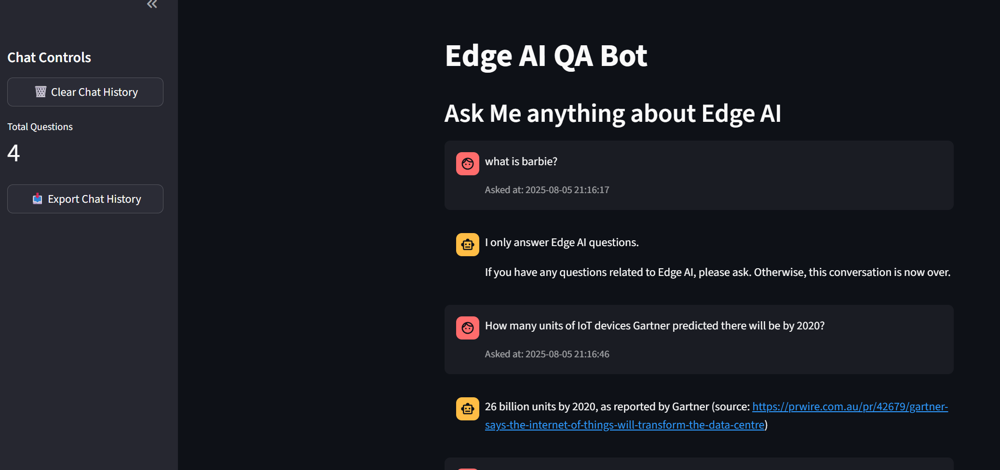

<a id="readme-top"></a>

# RAG Bot on Edge AI

**Name: Fabian Toh**
**Email: fabian_toh_yq@aiap.sg**

<!-- TABLE OF CONTENTS -->
<details>
  <summary>Table of Contents</summary>
  <ol>
    <li>
      <a href="#project-overview">Project Overview</a>
      <ul>
        <li><a href="#folder-structure">Folder-Structure</a></li>
      </ul>
    </li>
    <li>
      <a href="#getting-started">Getting Started</a>
      <ul>
        <li><a href="#setup">Setup</a></li>
        <li><a href="#execution">Execution Instructions</a></li>
      </ul>
    </li>
    <li><a href="#llm-stack">LLM Stack</a></li>
    <li><a href="#Streamlit">Sneakpeak of Frontend</a></li>
    <li>
        <a href="#evaluation">Evaluation</a>
        <ul>
            <li><a href="#metrics">Metrics Chosen</a></li>
            <li><a href="#results">Results Comparison</a></li>
        </ul>
    </li>
    <li><a href="#conclusion">Conclusion And Potential Improvements</a></li>
    <li><a href="#references-for-rag">References for RAG</a></li>
  </ol>
</details>

## Project Overview

This project implements a Retrieval-Augmented Generation (RAG) application that combines a FastAPI backend with a Streamlit frontend for interactive question answering over a custom document corpus. In this project, it focus on Edge AI.

The corpus used is a collection of different type of documents such as images, research paper, audio and video files, etc. This allow anyone to upload document and learn about their project domain, there may be a need to optimize the prompt for each use case.

### Folder Structure

```text
.
├── README.md
├── chromadb
│   └── chroma.sqlite3
├── conf
│   ├── config.yaml
│   └── logging.yaml
├── corpus
│   └── edge_ai
├── img
│   └── steamlit_frontend.png
├── logs
│   ├── debug.log
│   ├── info.log
│   └── warn.log
├── main.py
├── pyproject.toml
├── run.sh
├── src
│   ├── app_backend.py
│   ├── app_frontend.py
│   ├── data_loader.py
│   ├── embedder.py
│   ├── generator.py
│   ├── index_pipeline.py
│   ├── rag.py
│   ├── retriever.py
│   ├── scraper.py
│   ├── utils.py
│   └── vector_store.py
├── test_data
│   └── qa.json
└── uv.lock
```

<p align="right">(<a href="#readme-top">back to top</a>)</p>

### Setup
Clone the repo into your respective folder and change directory to edge_ai_rag_bot
```
cd edge_ai_rag_bot
```
Installing the dependencies 

#### Using UV (Recommended)
Create a UV virtual Environment and install all the necessary packages, you may skip this step if you intend to use run.sh or run.bat as it will automatically setup the environment for you.
```
uv venv
uv sync --active
```

#### Getting Data and Creating of folders

You will have to create these additional folders by yourself: chromadb, corpus, edge_ai (inside the corpus folder), logs.

The codes will auto generate outputs folder and the vector db in the chromadb folder iteself but you will have to get the resources in the corpus yourself and placed it in the corpus/egde_ai folder. You may refer to <a href="#references-for-rag">References for RAG</a> on where i get the data for this project from. Alternatively you may make use of any resources that you would like to use this repo.

#### Environment Variable
There is no need for any .env file as this project uses hugging face local inference with haystack framework.

<p align="right">(<a href="#readme-top">back to top</a>)</p>


### Execution

There are 3 main part to the batch file/run.sh file. First, it will run the main pipeline consisting of indexing the documents in the corpus folder and evaluating the generator. Next it will start the Fast API instance in localhost in the background. While running, it will also concurrently run streamlit in localhost in the background

If you are on a linux based system:
The script will create another uv virtual environment to simulate production environment.

```
cd path/to/edge_ai_rag_bot
chmod +x run.sh
./run.sh
```

#### Activate Virtual Environment
Activate the virtual environment that you have created using the uv commands previously.

Windows
```
.venv\Scripts\activate
```

Linux/Mac
```
source .venv/bin/activate
```

#### Setting up for playwright
Used for Web Scrapping of website in a recursive manner (Not used in current context)

```
playwright install
```

#### Indexing of RAG Material
You will only need to run this on the first time or whenever you have added additional resources to the corpus folder
```
python main.py
```

#### Starting FastAPI
```
uvicorn src.app_backend:app
```

#### Starting Steamlit
```
streamlit run src/app_frontend.py
```
<p align="right">(<a href="#readme-top">back to top</a>)</p>

#### Config Parameters

- **test_file_path:**  
  Path to the test questions and answers in JSON format that is used for evaluation.

- **chromedb_dir:**  
  Directory for storing the Chroma vector database.

- **corpus_dir:**  
  Directory containing the document corpus to be indexed.

- **rag_embedding_model_name:**  
  Name of the embedding model used for document indexing (e.g., `thenlper/gte-large`).

- **split_by:**  
  Method for splitting documents (e.g., by sentence).

- **split_length:**  
  Number of units (e.g., sentences) per split.

- **hf_gen_model:**  
  Name of the Hugging Face generative model used for answer generation.

- **bnb_quantize:**  
  Whether to use apply bnb quantization for generation model (Boolean). Do check if model supports bnb quantization

- **log_dir:**  
  Directory for storing log files.

- **indexing:**  
  Flag to enable or disable document indexing (Boolean).

## LLM Stack
1. openai-whisper > Transcribe audio and video file, model is downloaded and run locally
2. python-pptx > Convert powerpoint to text
3. PyPDF2 > Convert pdf to text
4. chromadb > Vector database to store embedding for RAG
5. pytorch > Backend deep learning frame work, torch audio is excluded
6. Haystack > A framework for to run rag/llm pipeline
7. Fast API > Backend microservice to performance inference from user
8. Streamlit > Frontend service for users to interact with RAG Question & Answer "Bot"

<p align="right">(<a href="#readme-top">back to top</a>)</p>

## Streamlit

A sneakpeek of the frontend UI. It is a simple Question & Answer interface that allows you to ask question and refers back to your previous questions.



<p align="right">(<a href="#readme-top">back to top</a>)</p>

## Evaluation

The reason for choosing the metrics is to quantify how closely generated answers match ground truth, help to assess relevance, accuracy, and fluency of model outputs.

### Metrics
1. ROUGE-1:
- Measures overlap of single words (unigrams) between generated and reference text.
- Indicates basic word-level similarity.

2. ROUGE-2:
- Measures overlap of two-word sequences (bigrams).
- Captures phrase-level similarity.

3. ROUGE-L:
- Measures the longest common subsequence of words.
- Reflects sentence-level structure and fluency.

4. BLEU Score:
- Evaluates how many n-grams in the generated text match the reference.
- Focuses on precision and fluency, commonly used in machine translation.
<p align="right">(<a href="#readme-top">back to top</a>)</p>

### Results

| Question | ROUGE-1 F1 | ROUGE-2 F1 | ROUGE-L F1 | BLEU Score |
| -------- | ---------- | ---------- | ---------- | ---------- |
| 1        | 0.067      | 0.045      | 0.056      | 0.020      |
| 2        | 0.645      | 0.621      | 0.645      | 0.599      |
| 3        | 0.406      | 0.318      | 0.365      | 0.160      |
| **Avg**  | **0.373**  | **0.328**  | **0.355**  | **0.260**  |

Test Question
1. How many units of IoT devices Gartner predicted there will be by 2020?
  - There will be 26 billion units by 2020
2. What are 4 typical scenario included by Edge AIBench?
  - They are intensive care unit (ICU) patient monitor, surveillance camera, smart home, and autonomous vehicle.
3. What is edge caching?
  - Edge caching refers to a distributed data system proximity to end users, which collects and stores the data generated by edge devices and surrounding environments, and the data received from the Internet to support intelligent applications for users at the edge


<p align="right">(<a href="#readme-top">back to top</a>)</p>

## Conclusion
1. Quantization of model is very important and it can be difficult to accomodate to different model e.g. not all model is supported by bitsandbytes quantization
2. Model size and Embedding method can affect inference operations hence it is important to choose a model that fit the require and does not devieate too much from performance
3. Prompt Engineering is very important in determining the output. The zephyr-7b-beta model actually hallucinate new questions especially when there is new context added to the input. Hence, there is a need to ask the generator to forcefully ends the conversation.

### Potential Improvements
1. Implementation of guardrails
2. Provide various options to host model
3. To implement adding of document to add into corpus from frontend
4. To include more kinds of document format e.g. json etc
5. Increase the number of test dataset

<p align="right">(<a href="#readme-top">back to top</a>)</p>

## References for RAG
Please kindly get your own resources or you may download these resources and place it in the corpus folder
```
CVPR. (2024, July 15). Edge AI in Action | Fabricio Narcizo | CVPR 2024 [Video]. YouTube. https://www.youtube.com/watch?v=-YxRFzVwFBc

Gao, W., Xiong, C., Luo, C., Wang, L., Zhang, F., Du, J., & others. (2019). Edge AIBench: Towards comprehensive end-to-end edge computing benchmarking. arXiv preprint arXiv:1908.01924.

Gill, S. S., Golec, M., Hu, J., Xu, M., Du, J., Wu, H., Walia, G. K., Murugesan, S. S., Ali, B., Kumar, M., Ye, K., Verma, P., Kumar, S., Cuadrado, F., & Uhlig, S. (2024). Edge AI: A taxonomy, systematic review and future directions (Version 2). arXiv preprint arXiv:2407.04053.

Microsoft. (2019, October 1). Intelligent Edge architecture [Diagram]. In What is AI@Edge? Microsoft. https://microsoft.github.io/ai-at-edge/docs/aiatedge/

Microsoft. (2019, October 1). Traditional IoT architecture [Diagram]. In What is AI@Edge? Microsoft. https://microsoft.github.io/ai-at-edge/docs/aiatedge/

Narcizo, F. (2024, June). *Edge AI in Action: Technologies and Applications* [Conference tutorial]. In *Proceedings of IEEE/CVF Conference on Computer Vision and Pattern Recognition (CVPR 2024)*.

NVIDIA. (2024, December 17). NVIDIA Jetson Orin Nano Super: A generative AI supercomputer [Video]. YouTube. https://www.youtube.com/watch?v=S9L2WGf1KrM

Zhou, Z., Chen, X., Li, E., Zeng, L., & Zhang, K. (2019). Edge intelligence: Paving the last mile of artificial intelligence with edge computing. arXiv preprint arXiv:2003.12172.
```

<p align="right">(<a href="#readme-top">back to top</a>)</p>